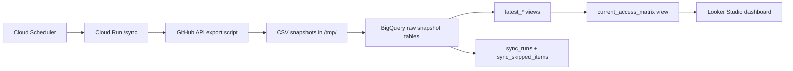

# GitHub Access Governance Sync

GitHub Access Governance Sync is a production-oriented reference implementation for exporting GitHub repository access, storing daily snapshots in BigQuery, and exposing current-state and historical views for Looker Studio.

It is designed for security, platform, and engineering governance use cases where teams need a repeatable way to answer:

- who has access to which repositories
- which access is direct versus team-derived
- where privileged access is concentrated
- whether outside collaborators or stale org states still have access
- whether the collection pipeline itself is healthy

No real organization data is included in this repository.

## What This Project Does

On each run, the service:

1. calls the GitHub REST API through `gh`
2. exports organization access data into CSV files under a per-run temporary directory
3. loads the CSVs into append-only BigQuery snapshot tables
4. refreshes `latest_*` views for current-state consumers
5. refreshes `current_access_matrix` for dashboarding
6. records sync telemetry in `sync_runs` and `sync_skipped_items`

The result is a model that supports both:

- audit and trend analysis from historical raw tables
- current-state reporting from stable reporting views

## Primary Use Cases

- GitHub access review and entitlement reporting
- Security governance dashboards
- Platform engineering ownership and team-access mapping
- Management visibility into privileged or exceptional access
- Operational monitoring of the sync pipeline itself

## Architecture



Supporting documentation:

- [Architecture](docs/architecture.md)
- [Deployment Guide](docs/deployment.md)
- [Dashboard Guide](docs/dashboard-guide.md)

## Repository Layout

- [app/](app): Flask service, loader logic, schemas, and BigQuery orchestration
- [scripts/](scripts): GitHub export script and GCP deployment helpers
- [tests/](tests): focused tests for parsing and view query generation
- [docs/](docs): architecture, deployment, and dashboard documentation
- [sample-data/](sample-data): synthetic example outputs for schema illustration

## Key Characteristics

- environment-driven configuration
- append-only snapshot model for audit history
- latest-state views for simple consumers
- reporting view for dashboard use
- retry handling for transient GitHub API failures
- explicit skipped-item logging instead of silent data loss
- authenticated Cloud Run endpoint for scheduled execution

## Runtime Configuration

The service reads these environment variables:

| Variable | Purpose | Default |
|---|---|---|
| `ORG` | GitHub organization to export | `example-org` |
| `BQ_PROJECT` | Target GCP project | `example-gcp-project` |
| `BQ_DATASET` | Target BigQuery dataset | `github_access_audit` |
| `BQ_LOCATION` | BigQuery and deployment region | `us-central1` |
| `EXPORT_SCRIPT_PATH` | Exporter path inside the container | `/app/scripts/export_all_access.sh` |
| `GH_TOKEN` | GitHub PAT injected from Secret Manager | none |

## Data Model

### Raw Snapshot Tables

The loader writes append-only data into these BigQuery tables:

| Table | Purpose |
|---|---|
| `repos` | Repository inventory and metadata |
| `org_memberships` | Org membership role and state per user |
| `outside_collaborators` | External users outside the org |
| `teams` | Team inventory |
| `team_members` | Team membership relationships |
| `team_repo_permissions` | Team-to-repository grants |
| `repo_user_permissions` | Effective repository access by user |
| `repo_team_permissions` | Team access visible from the repository side |
| `custom_repository_roles` | Custom role definitions when available |
| `sync_runs` | Run-level health and load summary |
| `sync_skipped_items` | API failures and skipped items per run |

Every snapshot table includes:

- `snapshot_date`
- `snapshot_ts`
- `run_id`
- `org`
- `source_file`

### Derived Views

| View | Purpose |
|---|---|
| `latest_<table>` | Most recent snapshot for a given raw table |
| `current_access_matrix` | Joined current-state model for dashboarding |

## API Surface

The Cloud Run service exposes:

- `GET /healthz`
  - lightweight health check
- `POST /sync`
  - executes one end-to-end sync run

The `/sync` endpoint should remain authenticated.

## Prerequisites

### Local Tooling

- Python 3.12+
- `gh`
- `jq`
- `gcloud`
- `bq`

### GCP Services

- Cloud Run
- Cloud Scheduler
- Secret Manager
- BigQuery
- Cloud Build
- Artifact Registry

### GitHub Token Permissions

Recommended minimum token access:

- Classic PAT: `read:org` and `repo`
- Fine-grained PAT: org member/team read plus repository metadata and collaborator read for the target repositories

## Quick Start

```bash
cd <repo-dir>
python3 -m venv .venv
source .venv/bin/activate
pip install -r requirements-dev.txt

export GH_TOKEN='your_pat'
export ORG='example-org'
export BQ_PROJECT='example-gcp-project'
export BQ_DATASET='github_access_audit'
export BQ_LOCATION='us-central1'

python -m app.main
```

Trigger a sync locally:

```bash
curl -X POST http://127.0.0.1:8080/sync
```

## Deploy To GCP

The deployment scripts are reusable and environment-driven. Do not edit the scripts for each environment; set the variables explicitly.

```bash
cd <repo-dir>

export PROJECT_ID='example-gcp-project'
export REGION='us-central1'
export DATASET='github_access_audit'
export ORG='example-org'
export SERVICE_NAME='github-access-sync'
export SECRET_NAME='github-access-token'
export GH_PAT='your_pat'

bash scripts/deploy.sh
```

If `GH_PAT` is not exported, the bootstrap step falls back to `gh auth token` from the local GitHub CLI keychain.

Detailed deployment and IAM guidance: [docs/deployment.md](docs/deployment.md)

## Dashboarding Model

Recommended usage pattern:

- use `current_access_matrix` for current-state access reporting
- use `latest_*` views for simple point-in-time reporting
- use raw snapshot tables and `sync_runs` for historical analysis and operational tracking

Step-by-step Looker Studio instructions: [docs/dashboard-guide.md](docs/dashboard-guide.md)

## Sample Output

Synthetic sample files are included to illustrate the reporting shape:

- [sample-data/current_access_matrix_sample.csv](sample-data/current_access_matrix_sample.csv)
- [sample-data/sync_runs_sample.csv](sample-data/sync_runs_sample.csv)

## Security Notes

- Keep the Cloud Run service private.
- Allow only approved callers such as Cloud Scheduler or a dedicated invoker service account.
- Do not commit PATs, `.env` files, service account keys, exported snapshots, or real dashboard screenshots.
- Treat `sync_skipped_items` as an operational signal; skipped reads should be reviewed, not ignored.
- Consider migrating from PAT-based auth to a GitHub App if you need stronger credential controls.

## Validation

Run the local verification suite:

```bash
cd <repo-dir>
python3 -m venv .venv
source .venv/bin/activate
pip install -r requirements-dev.txt
pytest
bash -n scripts/*.sh
python -m compileall app tests
```

## Limitations

- Export duration depends on organization size and GitHub API responsiveness.
- Some GitHub endpoints may intermittently fail or throttle; these are retried and then recorded as skipped items if they still fail.
- Custom repository roles may be unavailable depending on plan and token permissions.
- `current_access_matrix` is row-based, so distinct repo-user counts should use a calculated key instead of raw record count.

## Future Improvements

- GitHub App authentication
- Terraform for infrastructure provisioning
- CI for tests and static checks
- alerting on sync failures or abnormal skip volume
- richer lineage for direct versus inherited access paths
