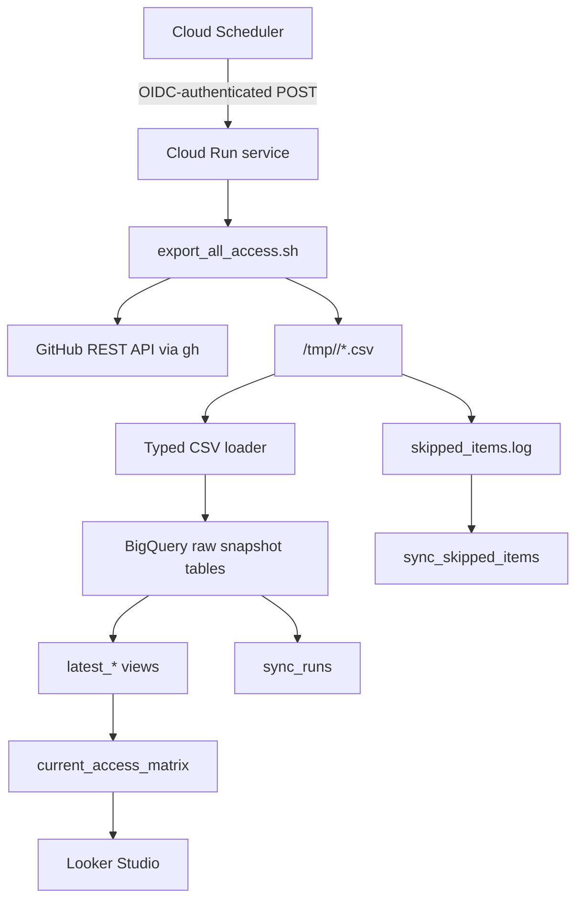

# Architecture

## Overview

The service performs a scheduled GitHub access export, stages the results as CSV files, loads them into append-only BigQuery tables, then exposes current-state and reporting views for downstream consumers.

This design separates:

- extraction from GitHub
- snapshot persistence in BigQuery
- current-state consumption through views
- operational observability for every run

## End-To-End Flow

## Component Responsibilities

### Cloud Scheduler

- triggers the sync on a fixed schedule
- uses OIDC auth to call the private Cloud Run service

### Cloud Run Service

- exposes `/sync` and `/healthz`
- creates a run-scoped working directory
- invokes the GitHub export script
- loads typed records into BigQuery
- refreshes views after a successful data load
- records sync status and errors

### Export Script

- calls GitHub REST endpoints through `gh api`
- writes CSV files that match expected table schemas
- retries transient failures
- writes persistent failures to `skipped_items.log`

### BigQuery Layer

- stores append-only snapshots for auditability
- provides `latest_*` views for consumers that only need the newest state
- provides `current_access_matrix` for a dashboard-friendly current view
- stores run health and skipped-item telemetry

## Table Groups

### Inventory And Metadata

- `repos`
- `teams`
- `custom_repository_roles`

### Identity And Relationships

- `org_memberships`
- `outside_collaborators`
- `team_members`

### Access Grants

- `team_repo_permissions`
- `repo_user_permissions`
- `repo_team_permissions`

### Observability

- `sync_runs`
- `sync_skipped_items`

## Why The Model Uses Snapshots

The snapshot pattern is deliberate:

- access changes over time and audit questions are inherently temporal
- daily append-only writes are simpler and safer than in-place updates
- latest-state views remove the need for dashboard users to reason about run IDs or timestamps

## Current-State Reporting Model

`current_access_matrix` joins the latest versions of:

- direct repository access from `latest_repo_user_permissions`
- team grants from `latest_repo_team_permissions` and `latest_team_repo_permissions`
- org membership metadata from `latest_org_memberships`
- outside collaborator flags from `latest_outside_collaborators`

The result is a practical current-state access table that can support executive summary views and technical drilldowns without forcing Looker Studio to perform complex blends.

## Reliability Characteristics

- transient GitHub API failures are retried with exponential backoff
- persistent failures are logged as skipped items
- run metadata is written even when the sync fails
- the reporting model stays auditable because skipped items are preserved instead of hidden

## Security Characteristics

- the Cloud Run service is intended to be private
- secrets are sourced from Secret Manager rather than committed configuration
- GitHub access is read-only at the API level for this use case
- scheduler-to-service invocation is intended to use a dedicated service account

## Recommended BigQuery Layout

- partition raw tables by `snapshot_date`
- cluster larger tables by natural access keys
  - `repo_user_permissions`: `repo`, `user`
  - `repo_team_permissions`: `repo`, `team_slug`
  - `team_members`: `team_slug`, `user`

These choices improve historical query cost and keep common dashboard access paths efficient.
